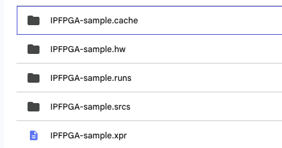

# サンプルコード置き場

## IPFPGA-sample_Vivado/IPFPGA-sample.srcs/sources_1/imports/new
- デフォルトのサンプルコード
- 電流FBなし、ホストプログラム.cの自己流サンプルコードもあり

## IPFPGA-sample_Vivado_edited_by_someone
- 誰かに少し書き換えられているコード

# 環境構築手順
1. プロジェクトファイルとか諸々1式を、これから作業をしようとするフォルダにコピペ。この際、手が加えられてないサンプルファイル/プロジェクトを利用（変なログとかが残ってないため）

  
  

  

<strong>諸々1式のファイルたち</strong>

2. Vivadoで"Open Project"をクリック
3. 上で諸々一式を入れたフォルダに行き、.xprの拡張子のついたプロジェクトファイルを選択
4. mwpe4_ipfpga_top.vhdをクリックし、下レイヤのファイルを覗く
5. 編集した.vhdファイル（大体はio_top.vhdとpwm_if.vhd）をダブルクリックし、編集画面を開く
6. 編集（エラーが出なくなるまで）
7. 編集が終わったら、左の画面からRun Synthesys実行
8. エラーが出たら6に戻る。無事終わったらRun Synthesysの下開いて、Set up debugを行う
9. 指定したデバッグコアが選択されていることを確認し進んでいく。途中でスコープに入れるクロック数（デフォルトで1024が選択されている）を指定。8192か16384を選択。それ以上だと重くて動かなくなる（たまに16384でも厳しい）
10. デバッグ終了したら、下の Run Implementation実行
11. エラーが出たら6.に戻る。無事終わったら下の Generate Bitstreamを実行
12. 無事終わったらコーティングはひとまず終了。下の Program device をクリック
13. Auto Connect でXilinxの赤いやつ使ってPE-expert4に回路合成（Program deviceを押せば書き込み？が始まる。数秒〜1分以内くらいで終わる）
14. 
